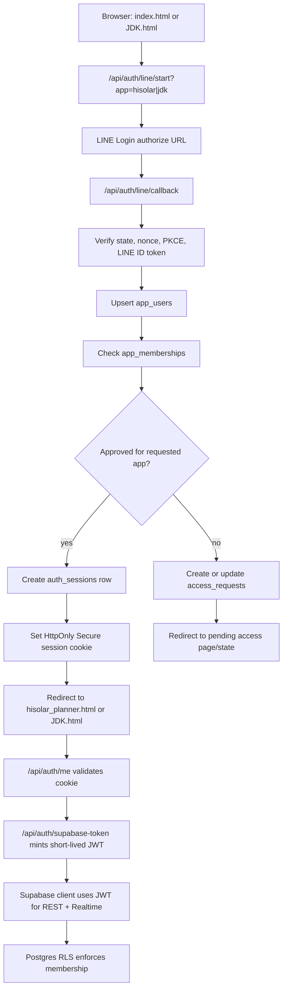

# LINE Login Architecture for Hi Solar Tracker

Date: 2026-07-11

Status: architecture plan only. This document does not change production code.

## Goal

Replace the current PIN/name-selection model with LINE Login backed by server-side session enforcement and Supabase RLS.

Target behavior:

- `index.html` is the Hi Solar entry only.
- `hisolar_planner.html` is available only to approved users with `membership = hisolar`.
- `JDK.html` is available only to users with `membership = jdk`.
- The PIN and user selection from `localStorage` are removed.
- LINE display name and profile picture are shown in the header and comments.
- Supabase Realtime remains available after authentication.
- Frontend-only route guards are treated only as UX. They are not the security boundary.

## Current Repository Findings

The current app is a static browser app using Supabase directly from the frontend, with Vercel-style API endpoints under `api/`.

Evidence checked:

- `index.html:340-341` lets the user choose between Hi Solar and JDK from the first modal.
- `index.html:1238-1241` accepts the hard-coded Hi Solar PIN `0091` and redirects to `hisolar_planner.html`.
- `index.html:1249-1250` redirects to `JDK.html`.
- `hisolar_planner.html:1542-1549` stores the selected Hi Solar user in `localStorage` as `hiSolarUser`.
- `hisolar_planner.html:1615-1627` inserts comments using the `localStorage` author.
- `hisolar_planner.html:3312-3342` initializes Supabase with the publishable key and treats a saved local name as identity.
- `JDK.html:929-931` has a frontend `VIEWER_USERS` allowlist.
- `JDK.html:1183-1192` stores the selected JDK viewer in `localStorage` as `hiSolarJdkViewerUser`.
- `JDK.html:1844-1864` checks `VIEWER_USERS` in the browser and inserts comments with that local name.
- `JDK.html:1946-1952` initializes Supabase and loads data when the saved local name is accepted.
- `supabase/schema.sql:215-219` enables RLS, but `supabase/schema.sql:221-324` creates public `anon` read/insert/update policies for jobs, comments, permits, and permit logs.
- `api/webhook/line-events.js` and `api/webhook/line-jdk-group.js` are LINE Messaging API webhooks, not LINE Login OAuth callbacks.
- `package.json` currently has only `@supabase/supabase-js`; LINE Login callback implementation will need JWT and cookie utilities or small local helpers.

Security implication: any user who has the public Supabase key and table names can bypass the UI and use current `anon` policies. The migration must move authorization into server-verified LINE identity plus Supabase RLS.

## External Constraints

LINE Login web apps use OAuth 2.0 authorization code flow and OpenID Connect. LINE's official docs require `state` for CSRF protection, support `nonce` in ID tokens, and support PKCE with `code_challenge` and `code_verifier`.

Useful official references:

- LINE Login web integration: https://developers.line.biz/en/docs/line-login/integrate-line-login/
- LINE Login PKCE: https://developers.line.biz/en/docs/line-login/integrate-pkce/
- LINE ID token verification: https://developers.line.biz/en/docs/line-login/verify-id-token/
- Supabase third-party auth limits: https://supabase.com/docs/guides/auth/third-party/overview
- Supabase RLS: https://supabase.com/docs/guides/database/postgres/row-level-security
- Supabase Realtime authorization: https://supabase.com/docs/guides/realtime/authorization

Important design choice: do not use LINE's raw ID token directly as the Supabase auth token. LINE web login ID tokens are HS256 for web login, while Supabase first-class third-party auth expects supported providers with asymmetric JWT behavior. Use a backend-authenticated session and mint a short-lived Supabase-compatible JWT for the browser.

## High-Level Architecture



Security boundary:

- Server callback verifies LINE identity.
- Session cookie proves the browser session.
- Supabase JWT proves the approved app user to Supabase.
- RLS enforces what rows/actions each membership can access.
- Frontend guards only improve UX and redirects.

## LINE OAuth Callback Flow

Use separate `app` values:

- `hisolar` for `index.html` and `hisolar_planner.html`
- `jdk` for `JDK.html`

Recommended endpoints:

- `GET /api/auth/line/start?app=hisolar|jdk`
- `GET /api/auth/line/callback`
- `GET /api/auth/me?app=hisolar|jdk`
- `POST /api/auth/logout`
- `GET /api/auth/supabase-token?app=hisolar|jdk`

Flow:

1. Browser requests `/api/auth/line/start?app=hisolar`.
2. Server validates `app`.
3. Server generates `state`, `nonce`, and `code_verifier`.
4. Server stores an auth attempt record or encrypted temporary cookie containing:
   - `state_hash`
   - `nonce_hash`
   - `code_verifier`
   - `app`
   - `return_to`
   - expiration, recommended 10 minutes
5. Server redirects to LINE authorize URL with:
   - `response_type=code`
   - `client_id`
   - `redirect_uri`
   - `state`
   - `scope=openid profile`
   - `nonce`
   - `code_challenge`
   - `code_challenge_method=S256`
6. LINE redirects to `/api/auth/line/callback?code=...&state=...`.
7. Server verifies:
   - callback `state` matches stored attempt
   - attempt is not expired or reused
   - `code` exists and no OAuth error was returned
8. Server exchanges the authorization code with LINE token endpoint, including the original `code_verifier`.
9. Server verifies the returned ID token, including:
   - signature using LINE verify endpoint or local validation
   - `aud` equals selected LINE Login channel ID
   - `iss` is LINE
   - `exp` is valid
   - `nonce` equals stored nonce
10. Server extracts LINE identity:
    - `sub` as stable LINE user ID for the channel/provider
    - `name` as LINE display name
    - `picture` as LINE profile image
11. Server upserts `app_users`.
12. If the requested app is `jdk` and the JDK membership is missing or still `pending`, server creates/updates `app_memberships` as `organization = 'jdk'`, `role = 'commenter'`, `status = 'approved'`, and closes any pending JDK access request. Suspended or revoked JDK memberships must stay blocked.
13. Server checks `app_memberships` for requested app and `status = approved`.
14. If approved, server creates a session, sets a secure cookie, and redirects to the app page.
15. If not approved, server creates or updates `access_requests` and redirects to a pending page/state.

Do not store LINE access tokens in the browser. The app only needs LINE identity, not long-lived LINE API access.

## Session Cookie

Use an opaque session token rather than putting user claims directly in the cookie.

Cookie recommendation:

- Name: `hs_session`
- Type: opaque random token, at least 32 bytes
- Store only a hash of the token in `auth_sessions`
- Flags:
  - `HttpOnly`
  - `Secure`
  - `SameSite=Lax`
  - `Path=/`
  - `Max-Age=604800` for 7 days, or shorter if preferred

Session validation:

- `/api/auth/me` reads cookie, hashes token, finds a non-revoked, non-expired session.
- It joins `app_users` and `app_memberships` for the requested app.
- It returns only safe profile data:
  - `user.id`
  - `display_name`
  - `picture_url`
  - memberships/roles approved for the requested app

Logout:

- Mark `auth_sessions.revoked_at = now()`.
- Clear `hs_session`.
- Client unsubscribes from Realtime channels and returns to the entry page.

## Data Model

Add these tables in an additive migration before changing production routes.

### `app_users`

Purpose: one canonical app user per LINE identity.

Columns:

- `id uuid primary key default gen_random_uuid()`
- `line_provider text not null default 'line'`
- `provider_namespace text not null default 'hisolar-tracker-line'`
- `line_channel_id text not null`
- `line_user_id text not null`
- `display_name text not null`
- `picture_url text`
- `last_login_at timestamptz`
- `created_at timestamptz not null default now()`
- `updated_at timestamptz not null default now()`

Constraints and indexes:

- `unique (provider_namespace, line_user_id)`
- index on `line_user_id`

Use one shared LINE Login channel for both Hi Solar and JDK. `provider_namespace` is the stable identity namespace for this tracker; `line_channel_id` remains metadata only and must not be used as the canonical identity key.

### `app_memberships`

Purpose: allow or deny access per organization/app.

Columns:

- `id uuid primary key default gen_random_uuid()`
- `user_id uuid not null references public.app_users(id) on delete cascade`
- `organization text not null check (organization in ('hisolar', 'jdk'))`
- `role text not null default 'member' check (role in ('admin', 'member', 'viewer', 'commenter'))`
- `status text not null default 'pending' check (status in ('pending', 'approved', 'suspended', 'revoked'))`
- `approved_by uuid references public.app_users(id)`
- `approved_at timestamptz`
- `created_at timestamptz not null default now()`
- `updated_at timestamptz not null default now()`

Constraints:

- `unique (user_id, organization)`

Access rules:

- Hi Solar app: require `organization = 'hisolar'` and `status = 'approved'`. Hi Solar approval stays manual.
- JDK app: require `organization = 'jdk'` and `status = 'approved'`. First-time or pending JDK users are auto-approved by the backend as `commenter`.
- JDK default role is `commenter`; do not grant job updates.

### `auth_sessions`

Purpose: server-side session registry.

Columns:

- `id uuid primary key default gen_random_uuid()`
- `user_id uuid not null references public.app_users(id) on delete cascade`
- `session_token_hash text not null unique`
- `user_agent text`
- `ip_hash text`
- `created_at timestamptz not null default now()`
- `last_seen_at timestamptz`
- `expires_at timestamptz not null`
- `revoked_at timestamptz`

Do not expose this table to browser roles.

### `access_requests`

Purpose: capture users who logged in with LINE but do not yet have approved membership.

Columns:

- `id uuid primary key default gen_random_uuid()`
- `user_id uuid not null references public.app_users(id) on delete cascade`
- `requested_organization text not null check (requested_organization in ('hisolar', 'jdk'))`
- `status text not null default 'pending' check (status in ('pending', 'approved', 'rejected', 'cancelled'))`
- `requested_at timestamptz not null default now()`
- `reviewed_by uuid references public.app_users(id)`
- `reviewed_at timestamptz`
- `note text`

Constraint:

- `unique (user_id, requested_organization, status)` is useful only if partial unique indexes are used. Prefer a partial unique index for pending requests:
  - unique pending request per `(user_id, requested_organization)` where `status = 'pending'`

## Comment Identity

Current comments store `author text` only. Keep it during migration for backward compatibility, then add authenticated identity columns.

Add to `hi_solar_job_comments`:

- `actor_user_id uuid references public.app_users(id)`
- `organization text check (organization in ('hisolar', 'jdk'))`
- `author_name_snapshot text`
- `author_picture_url_snapshot text`

Insert behavior:

- Browser no longer sends `author`.
- Browser sends only `job_id` and `message`.
- Supabase RLS or a database trigger sets:
  - `actor_user_id = auth.uid()`
  - `organization` from the authenticated app context
  - `author_name_snapshot` from `app_users.display_name`
  - `author_picture_url_snapshot` from `app_users.picture_url`
  - optionally keep `author = display_name` for legacy rendering

Rendering behavior:

- New UI displays `author_name_snapshot` and `author_picture_url_snapshot`.
- Legacy comments without `actor_user_id` fall back to existing `author`.
- Avoid rebuilding comment identity from the combined text log. Use structured comment rows as the source of truth.

## Short-Lived Supabase JWT

Because the browser still needs direct Supabase queries and Realtime, issue a short-lived JWT from the backend after session validation.

Recommended endpoint:

- `GET /api/auth/supabase-token?app=hisolar|jdk`

Token requirements:

- Lifetime: 5 to 10 minutes.
- Subject: `sub = app_users.id`.
- Role: `role = authenticated`.
- Claims:
  - `app_user_id`
  - `organizations` or current `organization`
  - `membership_role`
  - `membership_status = approved`
  - `display_name`
  - `picture_url`

Signing:

- Prefer a Supabase-supported asymmetric signing key configured for the project.
- Store private key only in server environment variables.
- Include `kid` if using asymmetric key rotation.
- Never expose service-role keys to the browser.

Client behavior:

- On app load, call `/api/auth/me?app=...`.
- If not approved, redirect to `/api/auth/line/start?app=...` or show pending status.
- Create the Supabase client only after auth is confirmed.
- Attach the short-lived JWT to Supabase requests. With the current static HTML pattern, this can be done by setting the `Authorization: Bearer <jwt>` header when creating the client and refreshing before expiry. If the implementation moves to a bundled JS app, use the current Supabase JS custom access token support available in that version.
- Refresh the Supabase JWT before it expires and call Realtime auth refresh or recreate channels if needed.

## RLS Design

Keep RLS as the real authorization boundary.

Helper function concept:

```sql
create or replace function public.has_membership(required_org text)
returns boolean
language sql
stable
as $$
  select exists (
    select 1
    from public.app_memberships m
    where m.user_id = auth.uid()
      and m.organization = required_org
      and m.status = 'approved'
  );
$$;
```

Policy direction:

- `hi_solar_jobs`
  - Hi Solar approved members can select all relevant Hi Solar operational rows.
  - Hi Solar approved members can insert/update rows according to current app behavior.
  - JDK approved members can select only JDK-relevant sheet keys, currently `ngan`, `langPaeng`, `som` as used by `JDK.html`.
  - JDK should not update jobs unless a role explicitly allows it.
- `hi_solar_job_comments`
  - Hi Solar approved members can select comments for jobs they can see.
  - JDK approved members can select comments for jobs they can see.
  - Insert requires approved membership for the requested organization and a visible `job_id`.
  - `actor_user_id` must equal `auth.uid()`.
- `hi_solar_permits` and `hi_solar_permit_logs`
  - Hi Solar approved members only.
  - JDK has no access unless later required.
- `app_users`
  - Authenticated user can read their own row.
  - Admins can read users and memberships for approval screens.
- `app_memberships`
  - Authenticated user can read own memberships.
  - Admins can approve/revoke within their organization.
- `auth_sessions`
  - No browser access.
  - Service-role/server only.

Cutover note: do not drop current `anon` policies until the new auth flow, JWT, RLS policies, and Realtime path are verified in preview. During the compatibility phase, new authenticated policies can exist alongside old public policies, but data is not secure until public policies are removed.

## Realtime Plan

Current app uses `postgres_changes` subscriptions:

- `hisolar_planner.html:1602-1612` subscribes to jobs, comments, permits, and permit logs, but current init does not call it in `hisolar_planner.html`.
- `JDK.html:1803-1817` subscribes to jobs and comments and calls `setupRealtime()`.
- `index.html:2502-2503` creates Supabase and calls `setupRealtime()`.

Target behavior:

- Initialize Realtime only after `/api/auth/me` succeeds and Supabase JWT is available.
- Use authenticated JWT for WebSocket connection.
- If token refresh fails, unsubscribe and redirect to login.
- Keep UX indicators:
  - connected
  - reconnecting
  - offline/auth expired
- After cutover, validate that `postgres_changes` events still arrive with RLS-protected users. If private channel authorization is later introduced, add policies to `realtime.messages`; for the immediate migration, focus on authenticated database changes and table RLS first.

## Environment Variables

Existing env vars to keep:

- `SUPABASE_URL`
- `SUPABASE_SERVICE_ROLE_KEY`
- `SYNC_CALENDAR_TOKEN`
- `GOOGLE_SERVICE_ACCOUNT_EMAIL`
- `GOOGLE_PRIVATE_KEY`
- `GOOGLE_CALENDAR_ID`
- `LINE_CHANNEL_SECRET` for existing capture webhook, if still used
- `LINE_JDK_CHANNEL_SECRET` for existing Messaging API webhook
- `LINE_JDK_CHANNEL_ACCESS_TOKEN` for existing Messaging API reply webhook

New env vars:

- `LINE_LOGIN_CHANNEL_ID`
- `LINE_LOGIN_CHANNEL_SECRET`
- `LINE_LOGIN_CALLBACK_URL`
- `LINE_LOGIN_PROVIDER_NAMESPACE`
- `AUTH_SESSION_COOKIE_NAME=hs_session`
- `AUTH_SESSION_SECRET`
- `AUTH_SESSION_MAX_AGE_SECONDS=604800`
- `SUPABASE_JWT_PRIVATE_KEY`
- `SUPABASE_JWT_KID`
- `SUPABASE_JWT_ISSUER`
- `SUPABASE_JWT_AUDIENCE`
- `APP_BASE_URL`

Naming rule: keep LINE Login channel env vars separate from LINE Messaging API env vars. Messaging API `channelSecret` verifies webhook signatures; LINE Login `channelSecret` verifies/exchanges OAuth credentials. Mixing them will cause auth failures and makes operations unclear.

## Migration and Cutover Plan

### Phase 0: Baseline and backup

- Export current Supabase schema and policies.
- Confirm current static app still works.
- Record current Vercel env vars.
- Do not remove PIN or `localStorage` yet.

### Phase 1: Additive database migration

- Add `app_users`, `app_memberships`, `auth_sessions`, and `access_requests`.
- Add comment identity columns.
- Add indexes and helper functions.
- Enable RLS on new tables.
- Keep existing `anon` policies on current production tables.

Result: zero behavior change for current users.

### Phase 2: Backend auth endpoints

- Add `/api/auth/line/start`.
- Add `/api/auth/line/callback`.
- Add `/api/auth/me`.
- Add `/api/auth/logout`.
- Add `/api/auth/supabase-token`.
- Use service-role only inside server endpoints.
- Add basic rate limiting where practical for start/callback/session endpoints.

Result: LINE users can log in and be marked pending or approved, while old app path still works.

### Phase 3: Admin approval seed

- Seed at least one Hi Solar admin membership manually in SQL.
- Approve Hi Solar users manually after their first LINE login creates a pending `access_requests` row.
- JDK users do not need manual approval; first login through `JDK.html` auto-creates an approved `jdk/commenter` membership unless that membership is suspended or revoked.

Result: there is a controlled path to approve Hi Solar users without opening Hi Solar public access, while JDK outsource users can enter through LINE Login without an approval queue.

### Phase 4: Frontend integration in preview

- `index.html` becomes Hi Solar entry only and starts LINE Login for `hisolar`.
- `hisolar_planner.html` calls `/api/auth/me?app=hisolar` before creating Supabase.
- `JDK.html` calls `/api/auth/me?app=jdk` before creating Supabase.
- Header uses `display_name` and `picture_url` from `/api/auth/me`.
- Comment UI uses structured comment identity fields.
- Do not rely on frontend redirect as authorization.

Result: preview deployment uses real LINE session and still coexists with old public policies.

### Phase 5: Authenticated Supabase and Realtime

- Switch Supabase client to use short-lived JWT.
- Refresh token before expiry.
- Start Realtime only after JWT is set.
- Validate `loadData`, insert comment, update job, permits, and Realtime reloads for approved Hi Solar.
- Validate JDK can only see/comment on JDK-allowed data.

Result: authenticated path is ready, but old public policies may still exist.

### Phase 6: RLS cutover

- Create authenticated RLS policies for all required tables.
- Remove public `anon` read/insert/update policies from current app tables.
- Confirm service-role integrations still work:
  - Google Apps Script sync
  - calendar sync endpoint
  - LINE Messaging API reminders/webhooks
- Deploy during a controlled window.

Result: database access is enforced by approved memberships.

### Phase 7: Cleanup

- Remove PIN UI and old name modal logic.
- Remove localStorage identity use.
- Remove dead `VIEWER_USERS` checks.
- Update setup guides and operational docs.
- Add admin/member approval documentation.

## Test Plan

### Unit tests

- PKCE generator creates 43-128 character verifier and S256 challenge.
- OAuth state and nonce are random, stored hashed, single-use, and expire.
- Callback rejects missing code, mismatched state, expired attempt, reused attempt, invalid nonce, wrong audience, and LINE error callbacks.
- Session token hashing validates correct token and rejects revoked/expired sessions.
- Supabase JWT contains expected `sub`, `role`, expiry, and membership claims.

### API integration tests

- `/api/auth/line/start?app=hisolar` redirects to LINE authorize URL with `scope=openid profile`, `state`, `nonce`, `code_challenge`, and `code_challenge_method=S256`.
- `/api/auth/line/start?app=jdk` uses the same shared LINE Login channel, but keeps JDK success and pending routes.
- `/api/auth/line/callback` creates `app_users` and pending `access_requests` for Hi Solar when no membership exists.
- `/api/auth/line/callback` auto-approves missing or pending JDK membership as `commenter`, but keeps suspended/revoked JDK users forbidden.
- Approved Hi Solar user receives a session and redirects to `hisolar_planner.html`.
- JDK user receives a session and redirects to `JDK.html` after backend auto-approval or existing approved membership.
- Suspended/revoked users cannot get `/api/auth/me` approval.
- `/api/auth/logout` revokes session and clears cookie.

### Database/RLS tests

- `anon` cannot read or write protected tables after cutover.
- Hi Solar approved member can read and write the same data needed by `hisolar_planner.html`.
- JDK approved member can read only intended JDK sheet keys and insert comments only on visible jobs.
- JDK member cannot update jobs or read permits unless explicitly granted.
- Comment insert sets `actor_user_id`, `author_name_snapshot`, and `author_picture_url_snapshot`.
- Legacy comments still render with fallback `author`.
- Service-role jobs, reminders, and calendar sync are unaffected by RLS.

### Frontend tests

- Mobile login from LINE in-app browser works.
- Mobile login from external browser works.
- Direct visit to `hisolar_planner.html` without a session redirects to LINE Login.
- Direct visit to `JDK.html` without a session redirects to LINE Login for JDK.
- Approved user sees LINE display name and profile picture in header.
- New comments show LINE name and picture.
- Map and phone links still work.
- Realtime indicator connects after auth and data reloads on changes.
- Expired session or failed token refresh shows a login-required state and stops Realtime.

### Manual acceptance checklist

- Hi Solar approved user: login, view all Hi Solar tabs, add job, update status, add comment, see Realtime reload.
- Hi Solar pending user: login, see pending approval, no Supabase data visible.
- New JDK LINE user: login, auto-approved as `commenter`, view JDK tabs, add comment, cannot access Hi Solar planner.
- Suspended/revoked JDK user: login attempt is blocked and no new session is issued.
- Direct browser calls with publishable key after cutover cannot read data as `anon`.

## Rollback Plan

Rollback before RLS cutover:

- Disable new auth entry points in frontend.
- Keep old app behavior because public policies were not removed.
- Leave additive tables in place; they do not affect current flows.

Rollback after RLS cutover:

- Re-apply the previous public `anon` policies from `supabase/schema.sql` only if operational continuity is more important than access control.
- Revert frontend to the last known working deployment.
- Keep `app_users`, `app_memberships`, and `auth_sessions`; they are additive.
- Revoke sessions if there is any suspected auth bug.
- Document exact time public policies were restored, because that reopens database access to the browser key.

Preferred emergency action:

- If only LINE Login is failing but authenticated Supabase/RLS works, keep RLS closed and fix auth endpoint/env configuration.
- Only restore public policies when field operations are blocked and the business accepts temporary exposure.

## Open Decisions

- Whether Hi Solar admins need an in-app approval UI immediately or first approvals can be seeded via SQL.
- Exact Supabase JWT signing-key setup in the project dashboard.
- Session lifetime policy: 7 days is convenient for field teams; 1 day is tighter.

## Scrutinize Verdict

Verdict: fix-then-ship.

The target architecture is appropriate, but the cutover must not be treated as complete until public `anon` policies are removed and verified. Before that point, LINE Login improves identity UX but does not secure Supabase data because direct browser access can still bypass frontend guards.
